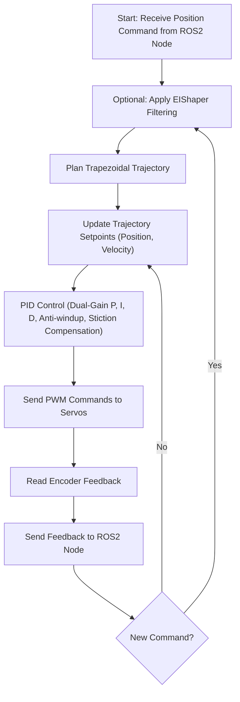

# Arm Optimization Algorithm Flowchart

```mermaid
flowchart TD
    A["Start: Receive Position Command from ROS2 Node"] --> B["Optional: Apply EIShaper Filtering"]
    B --> C["Plan Trapezoidal Trajectory"]
    C --> D["Update Trajectory Setpoints (Position, Velocity)"]
    D --> E["PID Control (Dual-Gain P, I, D, Anti-windup, Stiction Compensation)"]
    E --> F["Send PWM Commands to Servos"]
    F --> G["Read Encoder Feedback"]
    G --> H["Send Feedback to ROS2 Node"]
    H --> I{"New Command?"}
    I -- "Yes" --> B
    I -- "No" --> D
```

---

이 흐름도는 AstraArmController 펌웨어의 최적화된 팔 제어 알고리즘의 전체적인 데이터 흐름을 나타냅니다.
