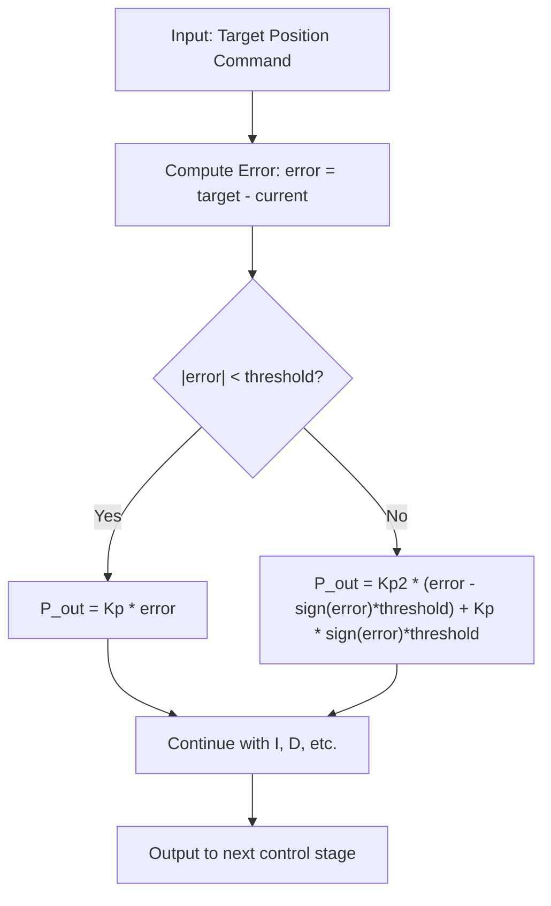

# Dual-Gain P Control Flowchart

```mermaid
flowchart TD
    A["Input: Target Position Command"] --> B["Compute Error: error = target - current"]
    B --> C{"|error| < threshold?"}
    C -- "Yes" --> D["P_out = Kp * error"]
    C -- "No" --> E["P_out = Kp2 * (error - sign(error)*threshold) + Kp * sign(error)*threshold"]
    D --> F["Continue with I, D, etc."]
    E --> F
    F --> G["Output to next control stage"]
```

---

이 다이어그램은 AstraArmController의 듀얼 게인 P 제어 알고리즘의 흐름을 나타냅니다.
