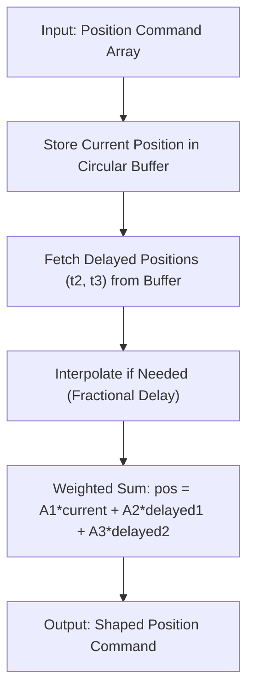

# EIShaper (입력 셰이핑) 알고리즘 Flowchart

```mermaid
flowchart TD
    A["Input: Position Command Array"] --> B["Store Current Position in Circular Buffer"]
    B --> C["Fetch Delayed Positions (t2, t3) from Buffer"]
    C --> D["Interpolate if Needed (Fractional Delay)"]
    D --> E["Weighted Sum: pos = A1*current + A2*delayed1 + A3*delayed2"]
    E --> F["Output: Shaped Position Command"]
```

---

이 다이어그램은 AstraArmController의 EIShaper(진동 억제 입력 셰이핑) 알고리즘의 흐름을 나타냅니다.
