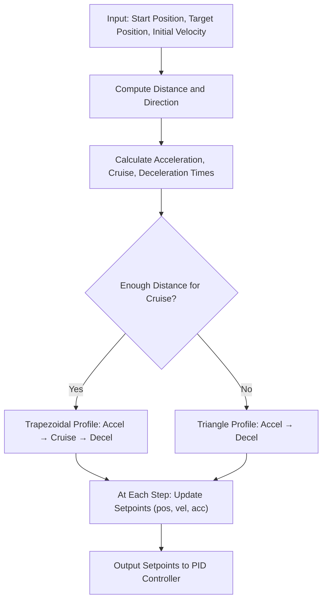

# Trapezoidal Trajectory Planning Flowchart

```mermaid
flowchart TD
    A["Input: Start Position, Target Position, Initial Velocity"] --> B["Compute Distance and Direction"]
    B --> C["Calculate Acceleration, Cruise, Deceleration Times"]
    C --> D{"Enough Distance for Cruise?"}
    D -- "Yes" --> E["Trapezoidal Profile: Accel → Cruise → Decel"]
    D -- "No" --> F["Triangle Profile: Accel → Decel"]
    E --> G["At Each Step: Update Setpoints (pos, vel, acc)"]
    F --> G
    G --> H["Output Setpoints to PID Controller"]
```

---

이 다이어그램은 AstraArmController의 트라페zoidal(사다리꼴) 트래젝토리 플래닝 알고리즘의 흐름을 나타냅니다.
