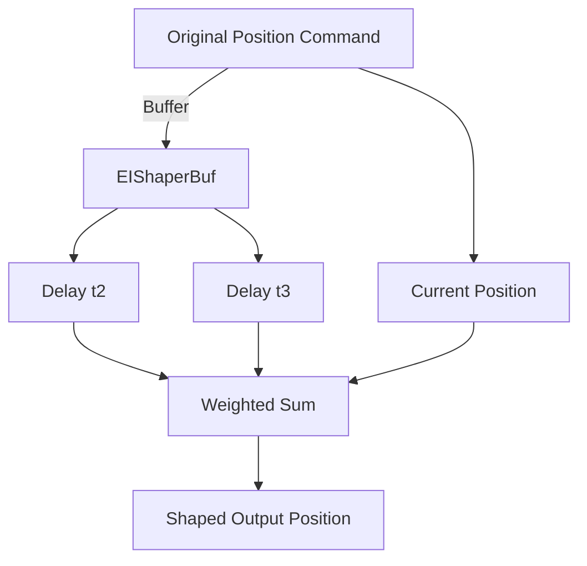
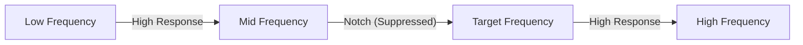

# EIShaper Algorithm Explanation

## Overview

The **EIShaper** (Extra-Insensitive Shaper) algorithm is implemented in the AstraArmController firmware to suppress vibrations and improve the smoothness of robotic arm motion. It works by filtering the joint position commands to reduce the excitation of the system's resonant frequencies, thus minimizing unwanted oscillations.

## Purpose

- **Vibration Suppression:** Reduces residual vibrations in robotic arms caused by rapid movements or resonance.
- **Motion Smoothness:** Ensures smoother transitions and more precise control of joint positions.

## Theory

### Input Shaping Principle
Input shaping is a control technique that modifies the command signal to a system to reduce vibration. It does this by convolving the original command with a sequence of impulses (shaper), whose timing and amplitudes are chosen based on the system's natural frequency and damping ratio.

#### Why Input Shaping?
When a robotic arm moves quickly, it can excite its natural frequencies, causing oscillations or vibrations. Input shaping pre-processes the command so that these vibrations are minimized, leading to more accurate and stable motion.

### Mathematical Derivation

The general input-shaped command is:

U_shaped(t) = Σ_{i=1}^{n} A_i * U(t - t_i)

Where:
- U(t): Original command
- A_i: Amplitude of the i-th impulse
- t_i: Time delay of the i-th impulse

For EIShaper (n=3):
- t1 = 0
- t2 = π / ω
- t3 = 2 * t2
- A1 = (1 + V) / 4
- A2 = (1 - V) / 2
- A3 = (1 + V) / 4

Where:
- ω = 2πf (rad/s), where f is the target frequency
- V is the suppression parameter

#### Frequency Response
The frequency response of the shaper can be analyzed by taking the Fourier transform of the impulse sequence. The shaper is designed so that the response at the target frequency is minimized (ideally zero), thus suppressing vibration at that frequency.

## Implementation Details

### Buffering
- A circular buffer (`EIShaperBuf`) stores the last 128 sets of joint positions (for 7 joints).
- The buffer allows the algorithm to access past joint positions at the required delays (t2, t3).

### Initialization (`EIShaperInit`)
- Reads configuration parameters: target frequency (`EIShaper_freq`), suppression parameter (`EIShaper_V`), and control frequency (`EIShaper_ctrl_freq`).
- Calculates the required delays and amplitudes.
- Converts continuous-time delays to discrete buffer indices based on the control period.
- Initializes the buffer with the current position.

### Application (`EIShaperApply`)
- On each control cycle, the current position is stored in the buffer.
- The output position is calculated as a weighted sum of the current and past positions, using the calculated amplitudes and interpolated buffer values for non-integer delays.
- The formula for each joint:

  ```cpp
  pos[i] = pos[i] * A1
    + (EIShaperBuf[t2][i] * T2_2 + EIShaperBuf[t2_2][i] * T2_1) * A2
    + (EIShaperBuf[t3][i] * T3_2 + EIShaperBuf[t3_2][i] * T3_1) * A3;
  ```
  Where `T2_1`, `T2_2`, `T3_1`, `T3_2` are interpolation factors for fractional delays.

#### Interpolation and Edge Cases
- **Fractional Delays:** Since t2 and t3 may not be integers, linear interpolation is used between the two nearest buffer entries to approximate the value at the exact fractional delay.
- **Buffer Wrap-Around:** The buffer is circular; indices are wrapped using modulo arithmetic to avoid out-of-bounds access.
- **Initialization:** The buffer is initialized with the current position to avoid undefined values at startup.

## Visual Diagrams

### 1. EIShaper Block Diagram


### 2. Timing Diagram

```mermaid
gantt
    dateFormat  s
    axisFormat  %S
    section Impulses
    A1 :a1, 0, 0.0
    A2 :a2, 0.1, 0.0
    A3 :a3, 0.2, 0.0
    section Buffer Access
    Current :done, 0, 0.0
    t2 :done, 0.1, 0.0
    t3 :done, 0.2, 0.0
```


### 3. Frequency Response (Conceptual)


## Example Calculation

Suppose:
- Target vibration frequency: **f = 5 Hz**
- Suppression parameter: **V = 0.8**
- Control frequency: **ctrl_freq = 200 Hz**

Calculate:
- ω = 2πf = 31.4159 rad/s
- t2 = π / ω = 0.1 s
- t3 = 0.2 s
- Control period T = 1 / 200 = 0.005 s
- t2_discrete = t2 / T = 20
- t3_discrete = t3 / T = 40
- A1 = (1 + 0.8) / 4 = 0.45
- A2 = (1 - 0.8) / 2 = 0.1
- A3 = (1 + 0.8) / 4 = 0.45

So, the shaped output at each cycle is:

```
pos[i] = pos[i] * 0.45
      + (EIShaperBuf[t2][i] * T2_2 + EIShaperBuf[t2_2][i] * T2_1) * 0.1
      + (EIShaperBuf[t3][i] * T3_2 + EIShaperBuf[t3_2][i] * T3_1) * 0.45
```

## Practical Example (Pseudocode)

```cpp
// Assume pos is the current joint position array
EIShaperInit(pos); // Initialize with current position

while (robot_is_running) {
    // ... update pos with new target positions ...
    EIShaperApply(pos); // Apply EIShaper filtering
    send_to_motor_controller(pos); // Send shaped positions
}
```

## Tuning Tips

- **EIShaper_freq**: Set to the dominant vibration frequency of your system (experimentally determined or from datasheet).
- **EIShaper_V**: Lower values increase suppression but may slow response. Start with 0.8-0.9 for moderate suppression.
- **EIShaper_ctrl_freq**: Should match your control loop rate.

## Benefits
- **Reduces residual vibration** after fast movements.
- **Improves accuracy** and repeatability of robotic arm positioning.
- **Easily tunable** for different hardware setups by adjusting configuration parameters.
- **Low computational cost**: Suitable for real-time embedded systems.

## References
- [Input Shaping for Vibration Reduction](https://en.wikipedia.org/wiki/Input_shaping)
- Singer, N. C., & Seering, W. P. (1990). Preshaping Command Inputs to Reduce System Vibration. *Journal of Dynamic Systems, Measurement, and Control*, 112(1), 76–82.
- [Practical Input Shaping Example (YouTube)](https://www.youtube.com/watch?v=QwogKeYxugw)
- [Input Shaping: Theory and Applications (MIT OpenCourseWare)](https://ocw.mit.edu/courses/mechanical-engineering/2-14-analysis-and-design-of-feedback-control-systems-fall-2014/lecture-notes/MIT2_14F14_Lec18.pdf)

---

*This document explains the EIShaper algorithm as implemented in `EIShaper.cpp` for AstraArmController.* 