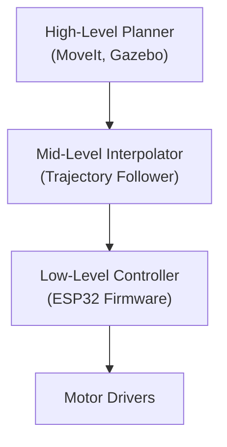
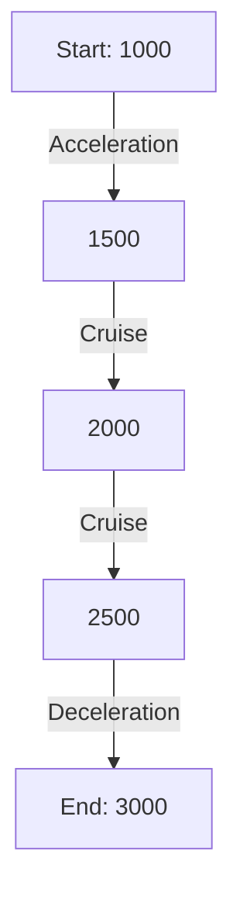

# Hierarchical Control in Robotics

## 1. Overview

Hierarchical control is a layered approach to robot control, where each layer is responsible for a different level of abstraction and timescale. This structure is essential for complex robots, such as manipulators, to achieve both high-level intelligence and low-level precision.

---

## 2. Typical Hierarchy

### **A. High-Level Planning (e.g., MoveIt, Gazebo, ROS Nodes)**
- **Role:** Plans the robot’s motion in task or joint space, considering the environment, obstacles, and global objectives.
- **Output:** A sequence of waypoints or a trajectory (positions, velocities, sometimes accelerations) for each joint.
- **Frequency:** Low (e.g., 10–100 Hz).
- **Example:** MoveIt computes a collision-free path for a robotic arm to pick up an object.

### **B. Mid-Level Control (Trajectory Interpolation)**
- **Role:** Interpolates between high-level waypoints to generate a smooth, continuous trajectory.
- **Output:** Finer-grained setpoints, possibly with velocity and acceleration profiles.
- **Frequency:** Medium (e.g., 100–500 Hz).
- **Example:** A trajectory follower node in ROS refines MoveIt’s waypoints into a smooth path.

### **C. Low-Level Control (Firmware, e.g., ESP32)**
- **Role:** Executes the trajectory in real time, generating motor commands at high frequency.
- **Output:** PWM signals, current/voltage commands, or other actuator-level signals.
- **Frequency:** High (e.g., 1 kHz or more).
- **Example:** The ESP32 runs a control loop, using a trapezoidal trajectory generator to ensure smooth, safe motion between setpoints.

---

## 3. Why Each Layer is Needed

- **High-Level:** Handles global reasoning, environment awareness, and complex planning.
- **Mid-Level:** Bridges the gap between abstract plans and physical execution, ensuring smoothness and feasibility.
- **Low-Level:** Deals with the realities of hardware—timing, safety, and precise control.

---

## 4. Trapezoidal Trajectory in the Hierarchy

As described in `TrapezoidalTrajectory_Explanation.md`, the **trapezoidal trajectory** is a motion profile that ensures smooth acceleration, cruising, and deceleration phases. This is crucial at the low-level (firmware) layer for several reasons:

- **Smoothness:** Prevents abrupt changes in velocity/acceleration, reducing mechanical stress.
- **Safety:** Enforces hardware limits, regardless of what the high-level planner requests.
- **Precision:** Provides the PID controller with continuous, well-behaved setpoints for optimal tracking.

> **From `TrapezoidalTrajectory_Explanation.md`:**
>
> “Trapezoidal trajectory planning is a software feature and works for any number of motors per joint. In the single-motor-per-joint firmware, each joint's motion is planned and executed smoothly, maximizing both speed and safety. The PID controller tracks the setpoints generated by the trajectory planner, resulting in precise, controlled movement.”

---

## 5. Example Flow

- **A:** Plans a path, outputs waypoints.
- **B:** Interpolates waypoints, refines trajectory.
- **C:** Generates smooth, real-time setpoints using trapezoidal trajectory (see `TrapezoidalTrajectory_Explanation.md`).
- **D:** Executes commands on hardware.

---

## 6. Practical Implications

- **Redundancy is Safety:** Even if the high-level planner outputs a smooth trajectory, the firmware must enforce local safety and smoothness.
- **Responsiveness:** The firmware can immediately stop or modify the trajectory in response to emergencies or new commands.
- **Hardware Protection:** The low-level controller ensures that the robot never exceeds safe velocities or accelerations, regardless of upstream errors.

---

## 7. Reference to `TrapezoidalTrajectory_Explanation.md`

Your documentation provides a comprehensive explanation of the mathematics, code, and practical benefits of trapezoidal trajectory planning. It emphasizes that this approach is essential for smooth, safe, and precise robotic arm motion, and is fully supported in the AstraArmController firmware.

---

## 8. Summary Table

| Layer         | Role                                 | Trajectory Type         | Frequency   |
|---------------|--------------------------------------|------------------------|-------------|
| High-Level    | Global planning, collision avoidance | Discrete waypoints     | 10–100 Hz   |
| Mid-Level     | Interpolation, smoothing             | Refined trajectory     | 100–500 Hz  |
| Low-Level     | Local execution, safety, smoothness  | Trapezoidal (firmware) | 1 kHz+      |

---

## 9. Practical Example: Trajectory Planning in Action

Suppose a robotic arm joint must move from an initial position of 1000 units to a target position of 3000 units, with a velocity limit of 800 units/s and an acceleration limit of 800 units/s². The hierarchical control flow would proceed as follows:

1. **High-Level Planner (MoveIt):**
   - Plans the move and outputs waypoints: e.g., [1000, 1500, 2000, 2500, 3000].
2. **Mid-Level Interpolator:**
   - Refines these waypoints into a smooth path, possibly adding intermediate points and velocity profiles.
3. **Low-Level Controller (ESP32 Firmware):**
   - For each segment, generates a trapezoidal trajectory (see `TrapezoidalTrajectory_Explanation.md`, Section 5) to ensure smooth acceleration, cruising, and deceleration.
   - The firmware computes the setpoints for each control loop iteration, ensuring hardware limits are never exceeded.

**Visualization:**

- The velocity profile for this move forms a trapezoid, as detailed in `TrapezoidalTrajectory_Explanation.md`, Section 3.

---

## 10. Cross-References

- For a detailed explanation of the mathematics and code implementation of trapezoidal trajectory planning, see [`TrapezoidalTrajectory_Explanation.md`](./TrapezoidalTrajectory_Explanation.md).
    - **Section 3:** Velocity profile diagrams
    - **Section 4:** Mathematical equations for each phase
    - **Section 5:** Code walkthrough of the planning and update functions
- For tuning guidelines and the effect in single-motor-per-joint setups, refer to Sections 6 and 7 of the same document.

---

## 11. Further Reading

- [MoveIt Documentation: Motion Planning Pipeline](https://moveit.picknik.ai/main/doc/motion_planning_pipeline/motion_planning_pipeline_tutorial.html)
- [ROS Control: Controller Manager](http://wiki.ros.org/ros_control)
- [ODrive: Trapezoidal Trajectory Source](https://github.com/odriverobotics/ODrive/blob/devel/Firmware/MotorControl/trapTraj.cpp)

---

**In conclusion:**  
Hierarchical control, with robust trajectory generation at the firmware level, is essential for safe, precise, and reliable robotic operation. For more on the implementation and theory, see [`TrapezoidalTrajectory_Explanation.md`](./TrapezoidalTrajectory_Explanation.md). 