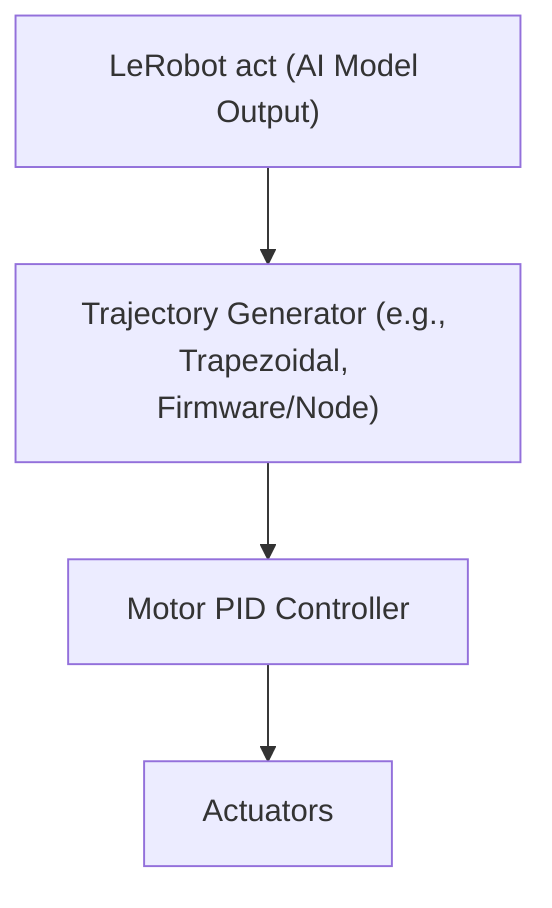
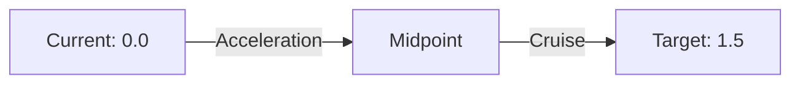

# Integrating LeRobot AI Models with Low-Level Trajectory Control

## 1. Overview

LeRobot and similar AI robotics frameworks often use high-level models (e.g., reinforcement learning policies) to generate actions for robots. While these models can output joint positions, velocities, or torques, **directly sending these outputs to the robot's actuators is not optimal or safe for real hardware**. This document explains why, and how to properly integrate low-level trajectory control for robust, safe, and smooth operation.

---

## 2. What Does LeRobot `act` Output?

- The `act` function in LeRobot typically outputs one of the following for each joint:
  - **Target position**
  - **Target velocity**
  - **Target torque**
- In simulation, these can be sent directly to the simulated robot.
- On real hardware, **directly sending these to the motor PID or hardware interface can be risky**.

---

## 3. Risks of Direct Control

| Issue                | Description                                                                 |
|----------------------|-----------------------------------------------------------------------------|
| No smoothing         | AI outputs may change abruptly, causing jerky or unsafe motion               |
| No safety enforcement| Commands may exceed hardware velocity, acceleration, or torque limits        |
| No trajectory planning| Robot may not follow a physically feasible or optimal path                   |
| Hardware risk        | Sudden/extreme commands can damage motors, gears, or the robot structure     |

**Direct control is common in simulation or research, but not recommended for real robots.**

---

## 4. Best Practice: Insert a Low-Level Trajectory Controller

**Recommended architecture:**

- **AI Model:** Decides the goal (e.g., "move to X").
- **Trajectory Generator:** Plans a smooth, safe path to X, respecting all hardware limits (see also [`TrapezoidalTrajectory_Explanation.md`](./TrapezoidalTrajectory_Explanation.md)).
- **PID Controller:** Tracks the setpoints generated by the trajectory generator.
- **Actuators:** Execute the commands.

---

## 5. How to Implement with LeRobot

### **Option 1: Position Output**
- If `act` outputs a target position, feed this to a trajectory generator (e.g., trapezoidal profile) running on your microcontroller or as a ROS node.
- The trajectory generator interpolates from the current position to the target, generating smooth setpoints for the PID controller.

### **Option 2: Velocity or Torque Output**
- If `act` outputs velocity or torque, use a low-level controller to filter, clamp, or smooth these commands before sending them to the hardware.
- You may implement rate limiters, safety checks, or even a secondary trajectory generator.

---

## 6. Example: Position Command with Trajectory Generation

Suppose LeRobot's `act` outputs a target joint position of 1.5 radians. The current joint position is 0.0 radians.

1. **AI Model:** `act = 1.5`
2. **Trajectory Generator:** Plans a trapezoidal trajectory from 0.0 to 1.5 radians, respecting velocity and acceleration limits.
3. **PID Controller:** Receives smooth setpoints at each control loop iteration.
4. **Actuator:** Moves smoothly to 1.5 radians.

**Visualization:**

---

## 7. Summary Table

| Approach                        | Safety | Smoothness | Hardware Protection | Recommended for Real Robots? |
|----------------------------------|--------|------------|--------------------|------------------------------|
| LeRobot act → Motor PID (direct) | Low    | Low        | Low                | ❌ No                        |
| LeRobot act → Trajectory Gen → PID | High   | High       | High               | ✅ Yes                       |

---

## 8. Practical Advice

- **Always insert a trajectory generator or safety layer between AI outputs and hardware.**
- **Tune velocity and acceleration limits** in the trajectory generator to match your robot's capabilities.
- **Monitor for out-of-range or abrupt commands** from the AI model, and handle them safely.
- **Test in simulation first, then on hardware with conservative limits.**

---

## 9. References and Further Reading

- [`TrapezoidalTrajectory_Explanation.md`](./TrapezoidalTrajectory_Explanation.md): Details on trajectory generation and its importance.
- [`Hierarchical_Control_Explanation.md`](./Hierarchical_Control_Explanation.md): Overview of layered control in robotics.
- [MoveIt Documentation: Motion Planning Pipeline](https://moveit.picknik.ai/main/doc/motion_planning_pipeline/motion_planning_pipeline_tutorial.html)
- [ODrive: Trapezoidal Trajectory Source](https://github.com/odriverobotics/ODrive/blob/devel/Firmware/MotorControl/trapTraj.cpp)

---

**In summary:**

> For real robots, always use a low-level trajectory controller between LeRobot (or any AI model) and the hardware. This ensures safety, smoothness, and reliable operation. 