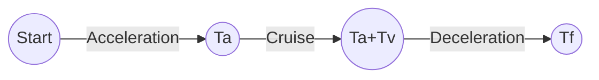

# TrapezoidalTrajectory in AstraArmController Firmware

## Overview

`TrapezoidalTrajectory` is a class used in the AstraArmController firmware to generate smooth, kinematically-constrained motion profiles for each joint. It ensures that the robot's joints move from a start position to a target position while respecting velocity and acceleration limits, resulting in a velocity profile that looks like a trapezoid (or triangle for short moves).

---

## How It Works in `dualMotor.cpp`

- Each joint has its own `TrapezoidalTrajectory` instance (see: `TrapezoidalTrajectory traj[JOINT_NUM];`).
- When a new target position is set, `planTrapezoidal(target, current, current_velocity)` is called to plan the motion.
- On each control loop (timer interrupt), `traj[i].update()` is called, which advances the trajectory and updates the setpoints for position, velocity, and torque.
- The PID controller uses these setpoints to generate motor commands.

---

## Trajectory Phases

1. **Acceleration:** Joint speeds up to max velocity.
2. **Cruise:** Joint moves at max velocity.
3. **Deceleration:** Joint slows down to stop at the target.

If the move is too short to reach max velocity, the profile becomes a triangle (no cruise phase).

---

## Diagram: Velocity Profile


- **Ta:** Acceleration time
- **Tv:** Cruise time
- **Td:** Deceleration time
- **Tf:** Total time

---

## Key Methods

- `planTrapezoidal(Xf, Xi, Vi)`: Plans the trajectory from initial position `Xi` to final position `Xf` with initial velocity `Vi`.
- `update()`: Advances the trajectory by one control period, updating setpoints.
- `eval(t)`: Computes position, velocity, and acceleration at time `t`.

---

## Dummy Data Example

Suppose:
- Start position (`Xi`): 1000
- Target position (`Xf`): 3000
- Initial velocity (`Vi`): 0
- Velocity limit: 800
- Acceleration limit: 800
- Deceleration limit: 800
- Control period: 0.015s (15ms)

### 1. Plan the Trajectory
```cpp
TrapezoidalTrajectory traj;
traj.config_.vel_limit = 800;
traj.config_.accel_limit = 800;
traj.config_.decel_limit = 800;
traj.config_.current_meas_period = 0.015;
traj.planTrapezoidal(3000, 1000, 0);
```

### 2. Step Through the Trajectory
For each control loop (every 0.015s):
```cpp
for (int step = 0; !traj.trajectory_done_; ++step) {
    traj.update();
    printf("t=%.3f pos=%.2f vel=%.2f acc=%.2f\n", traj.t_, traj.pos_setpoint_, traj.vel_setpoint_, traj.torque_setpoint_);
}
```

### 3. Example Output (abridged)
| t (s) | pos_setpoint | vel_setpoint | acc_setpoint |
|-------|--------------|--------------|--------------|
| 0.015 | 1000.09      | 12.00        | 800.00       |
| 0.030 | 1000.36      | 24.00        | 800.00       |
| ...   | ...          | ...          | ...          |
| 1.000 | 1400.00      | 800.00       | 0.00         |
| ...   | ...          | ...          | ...          |
| 2.000 | 2600.00      | 800.00       | 0.00         |
| ...   | ...          | ...          | ...          |
| 2.500 | 3000.00      | 0.00         | 0.00         |

- The joint accelerates up to 800 units/s, cruises, then decelerates to stop at 3000.
- The setpoints are updated every control period for smooth motion.

---

## Summary

- `TrapezoidalTrajectory` ensures safe, smooth, and precise joint motion.
- Used in `dualMotor.cpp` to generate setpoints for each joint.
- Respects velocity and acceleration limits, preventing mechanical stress.
- Dummy data shows how setpoints evolve over time for a typical move.

---

**References:**
- See also: `TrapezoidalTrajectory_Explanation.md` for more math and diagrams.
- Source code: `trapTraj.cpp`, `trapTraj.hpp`, and usage in `dualMotor.cpp`. 