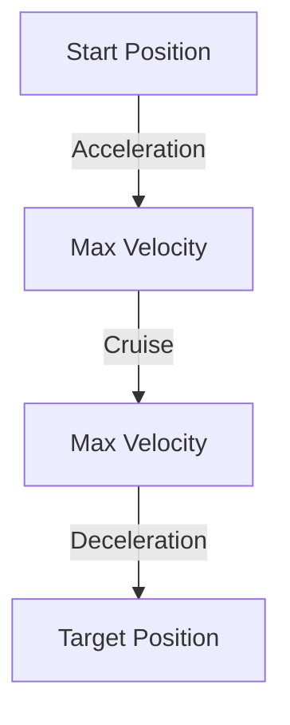
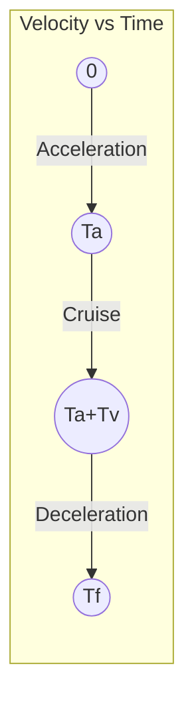

# Trapezoidal Trajectory Planning in AstraArmController Firmware

## 1. What is Trapezoidal Trajectory?

A **trapezoidal trajectory** is a motion profile used to move a joint smoothly from one position to another. The velocity profile of the move forms a trapezoid shape:
- **Acceleration phase:** Velocity ramps up linearly to a maximum value.
- **Constant velocity (cruise) phase:** Velocity stays at the maximum value.
- **Deceleration phase:** Velocity ramps down linearly to zero.

This ensures smooth, controlled motion that respects velocity and acceleration limits.

---

## 2. Why Use Trapezoidal Trajectory?

- **Prevents sudden jumps:** Avoids abrupt changes in speed that can cause mechanical stress or vibration.
- **Respects hardware limits:** Ensures the arm never exceeds safe velocity or acceleration.
- **Smooth, predictable motion:** Makes the arm's movement more precise and easier to control.
- **Improves control:** The PID controller receives setpoints that change smoothly, improving tracking and stability.

---

## 3. Trapezoidal Velocity Profile Diagram



Or as a velocity-time plot:



- **Ta:** Acceleration time
- **Tv:** Cruise time
- **Td:** Deceleration time
- **Tf:** Total time (Ta + Tv + Td)

---

## 4. Mathematical Equations

Let:
- $X_i$ = initial position
- $X_f$ = final position
- $V_i$ = initial velocity
- $V_{max}$ = velocity limit
- $A_{max}$ = acceleration limit
- $D_{max}$ = deceleration limit

### **Phases:**

#### **1. Acceleration Phase ($0 \leq t < T_a$):**
- $Y(t) = X_i + V_i t + \frac{1}{2} A_r t^2$
- $Y'(t) = V_i + A_r t$
- $Y''(t) = A_r$

#### **2. Cruise Phase ($T_a \leq t < T_a + T_v$):**
- $Y(t) = Y_{accel} + V_r (t - T_a)$
- $Y'(t) = V_r$
- $Y''(t) = 0$

#### **3. Deceleration Phase ($T_a + T_v \leq t < T_f$):**
- $Y(t) = X_f + \frac{1}{2} D_r (t - T_f)^2$
- $Y'(t) = D_r (t - T_f)$
- $Y''(t) = D_r$

#### **4. After Trajectory ($t \geq T_f$):**
- $Y(t) = X_f$
- $Y'(t) = 0$
- $Y''(t) = 0$

Where:
- $A_r$ = signed acceleration
- $D_r$ = signed deceleration
- $V_r$ = signed cruise velocity

---

## 5. Code Walkthrough

### **planTrapezoidal**
```cpp
bool TrapezoidalTrajectory::planTrapezoidal(float Xf, float Xi, float Vi) {
    t_ = 0.0f;
    trajectory_done_ = false;
    float Vmax = config_.vel_limit;
    float Amax = config_.accel_limit;
    float Dmax = config_.decel_limit;

    float dX = Xf - Xi;  // Distance to travel
    float stop_dist = (Vi * Vi) / (2.0f * Dmax); // Minimum stopping distance
    float dXstop = std::copysign(stop_dist, Vi); // Minimum stopping displacement
    float s = sign_hard(dX - dXstop); // Direction
    Ar_ = s * Amax;  // Max Acceleration (signed)
    Dr_ = -s * Dmax; // Max Deceleration (signed)
    Vr_ = s * Vmax;  // Max Velocity (signed)

    // If starting too fast, decelerate first
    if ((s * Vi) > (s * Vr_)) {
        Ar_ = -s * Amax;
    }

    // Time to accel/decel to/from Vr
    Ta_ = (Vr_ - Vi) / Ar_;
    Td_ = -Vr_ / Dr_;

    // Minimum displacement to reach cruise speed
    float dXmin = 0.5f*Ta_*(Vr_ + Vi) + 0.5f*Td_*Vr_;

    // Can we reach cruise speed?
    if (s*dX < s*dXmin) {
        // Short move (triangle profile)
        Vr_ = s * std::sqrt(std::max((Dr_*SQ(Vi) + 2*Ar_*Dr_*dX) / (Dr_ - Ar_), 0.0f));
        Ta_ = std::max(0.0f, (Vr_ - Vi) / Ar_);
        Td_ = std::max(0.0f, -Vr_ / Dr_);
        Tv_ = 0.0f;
    } else {
        // Long move (trapezoidal profile)
        Tv_ = (dX - dXmin) / Vr_;
    }

    Tf_ = Ta_ + Tv_ + Td_;
    Xi_ = Xi;
    Xf_ = Xf;
    Vi_ = Vi;
    yAccel_ = Xi + Vi*Ta_ + 0.5f*Ar_*SQ(Ta_); // pos at end of accel phase

    return true;
}
```
- **Computes**: durations for acceleration, cruise, and deceleration.
- **Handles**: both long (trapezoidal) and short (triangle) moves.

### **update**
```cpp
void TrapezoidalTrajectory::update() {
    if (trajectory_done_) return;
    t_ += config_.current_meas_period;
    TrapezoidalTrajectory::Step_t traj_step = eval(t_);
    pos_setpoint_ = traj_step.Y;
    vel_setpoint_ = traj_step.Yd;
    torque_setpoint_ = traj_step.Ydd * config_.inertia;
    if (t_ >= Tf_) trajectory_done_ = true;
}
```
- **Advances** the trajectory by one control period.
- **Updates** position, velocity, and torque setpoints for the PID controller.

---

## 6. How to Tune Trapezoidal Trajectory

- **Velocity limit (`joint_vel_max`):** Maximum speed the joint can reach during the move.
- **Acceleration limit (`joint_acc`):** Maximum acceleration/deceleration allowed.
- These parameters are set in the configuration and can be tuned for your hardware:
  - Lower values = smoother, slower motion (gentle on hardware)
  - Higher values = faster, more aggressive motion (may cause vibration if too high)

**Tuning steps:**
1. Start with conservative (low) values for both limits.
2. Gradually increase until you reach the desired speed, without causing instability or excessive vibration.

---

## 7. Effect in Single-Motor-Per-Joint Setup

- Trapezoidal trajectory planning is a software feature and works for any number of motors per joint.
- In the single-motor-per-joint firmware, each joint's motion is planned and executed smoothly, maximizing both speed and safety.
- The PID controller tracks the setpoints generated by the trajectory planner, resulting in precise, controlled movement.

---

## 8. Practical Example

Suppose:
- Start position: 1000
- Target position: 3000
- Velocity limit: 800
- Acceleration limit: 800

The planner will:
- Accelerate from 1000 to max speed (800),
- Cruise at 800 until near 3000,
- Decelerate smoothly to stop exactly at 3000.

---

## 9. Summary

Trapezoidal trajectory planning is essential for smooth, safe, and precise robotic arm motion. It is fully supported in the AstraArmController firmware for each joint, ensuring optimal performance in your single-motor-per-joint setup. 