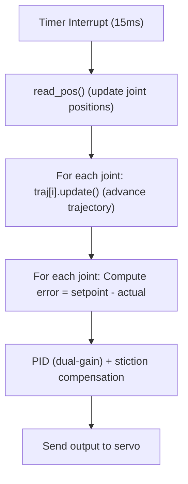

# How `timer_callback` Works in AstraArmController Firmware (Trajectory Perspective)

## Overview

The `timer_callback` function in `dualMotor.cpp` is the heart of the real-time control loop for the AstraArmController firmware. It is responsible for periodically updating the state of each joint, advancing their motion trajectories, and computing the control outputs that drive the motors. This function is called automatically by a hardware timer at a fixed interval (every 15ms, or ~66.67Hz).

---

## Timer Setup

The timer is initialized in `dualMotorSetup()`:

```cpp
void dualMotorSetup() {
  // ...
  const esp_timer_create_args_t timer_args = {
    .callback = &timer_callback
  };
  ESP_ERROR_CHECK(esp_timer_create(&timer_args, &timer));
  ESP_ERROR_CHECK(esp_timer_start_periodic(timer, TIMER_TIMEOUT_US));
}
```
- **TIMER_TIMEOUT_US** is set to 15000 (15ms).
- The callback function `timer_callback` is called every 15ms by the ESP32 hardware timer.

---

## Control Loop: What Happens Each Tick?

Every time `timer_callback` is invoked, it performs the following steps:

1. **Handle Torque/Init Requests:**
   - If there are pending requests to enable torque or initialize a joint, these are handled first.
2. **Check System State:**
   - If torque is not enabled or the initial joint positions are not set, the function returns early.
3. **Read Current Joint Positions:**
   - Calls `read_pos()` to update the latest encoder readings for each joint.
4. **Advance Trajectories:**
   - For each joint, calls `traj[i].update()`, which advances the trapezoidal trajectory by one control period and updates the setpoints for position, velocity, and torque.
5. **Compute Control Output:**
   - For each joint, computes the error between the trajectory setpoint and the actual position, then applies a PID (with dual-gain P) control law to compute the output command.
6. **Send Commands to Motors:**
   - The computed outputs are sent to the servos via `sts.writeWord()`.

---

## Trajectory Update in Detail

### The Role of `traj[i].update()`

Each joint has its own `TrapezoidalTrajectory` object (`traj[i]`). The `update()` method:
- Advances the internal time by one control period (15ms).
- Evaluates the trajectory at the new time, updating:
  - `pos_setpoint_`: Desired position
  - `vel_setpoint_`: Desired velocity
  - `torque_setpoint_`: Desired acceleration * inertia
- Sets `trajectory_done_` to true if the motion is complete.

**Code Reference:**
```cpp
void timer_callback(void *arg) {
  // ...
  read_pos();
  float goal_pos[JOINT_NUM];
  for (int i = 0; i < JOINT_NUM; ++i) {
    traj[i].update();
    goal_pos[i] = traj[i].pos_setpoint_;
  }
  // ... PID and output logic ...
}
```

### What Does `traj[i].update()` Actually Do?

See `trapTraj.cpp`:
```cpp
void TrapezoidalTrajectory::update() {
    if (trajectory_done_) return;
    t_ += config_.current_meas_period;
    Step_t traj_step = eval(t_);
    pos_setpoint_ = traj_step.Y;
    vel_setpoint_ = traj_step.Yd;
    torque_setpoint_ = traj_step.Ydd * config_.inertia;
    if (t_ >= Tf_) trajectory_done_ = true;
}
```
- **Advances time** by the control period.
- **Evaluates** the trajectory at the new time.
- **Updates setpoints** for the control loop.
- **Marks as done** if the trajectory is finished.

---

## Control Loop Flowchart



---

## Example: Trajectory Progression

Suppose a new target is set for a joint. The following happens:
1. `traj[i].planTrapezoidal(target, current, current_velocity)` is called (see `dualMotorUpdatePos`).
2. On each timer tick, `traj[i].update()` advances the trajectory, updating the setpoint.
3. The control loop computes the error and outputs a command to the motor.
4. When the trajectory is complete, `trajectory_done_` is set, and the joint holds position.

---

## Summary Table

| Step                | Function/Method         | Purpose                                      |
|---------------------|------------------------|----------------------------------------------|
| Timer tick (15ms)   | `timer_callback`       | Main control loop                            |
| Read positions      | `read_pos()`           | Get current joint positions                  |
| Advance trajectory  | `traj[i].update()`     | Update setpoints for each joint              |
| Compute control     | PID + dual-gain logic  | Calculate output for each joint              |
| Output to motors    | `sts.writeWord()`      | Send command to servos                       |

---

## References
- Source: `dualMotor.cpp`, `trapTraj.cpp`
- See also: [TrapezoidalTrajectory_Dummy_Explanation.md](src/TrapezoidalTrajectory_Dummy_Explanation.md)
- For PID/dual-gain details: [DualGainPControl_Explanation.md](src/DualGainPControl_Explanation.md) 