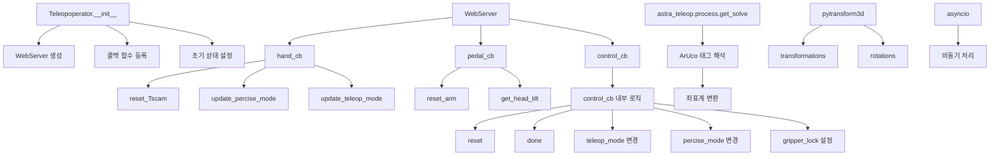
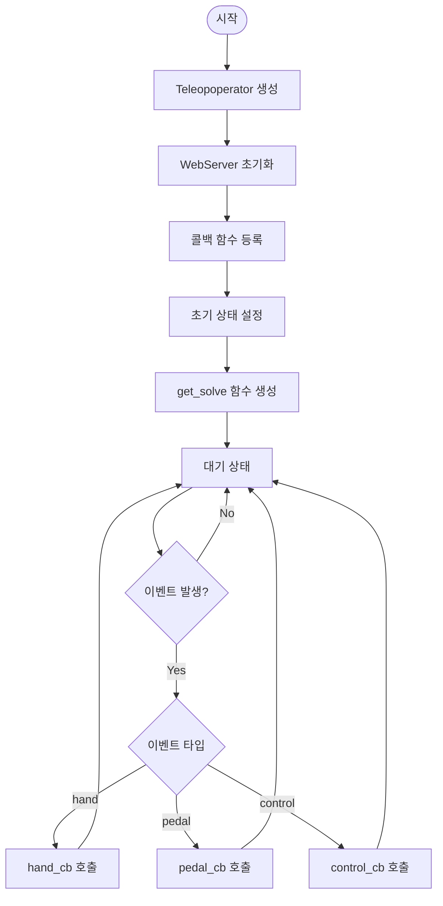
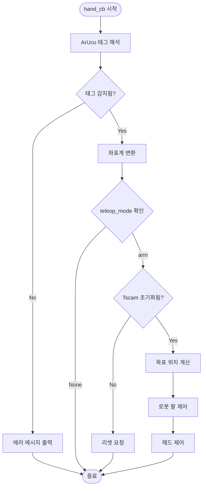
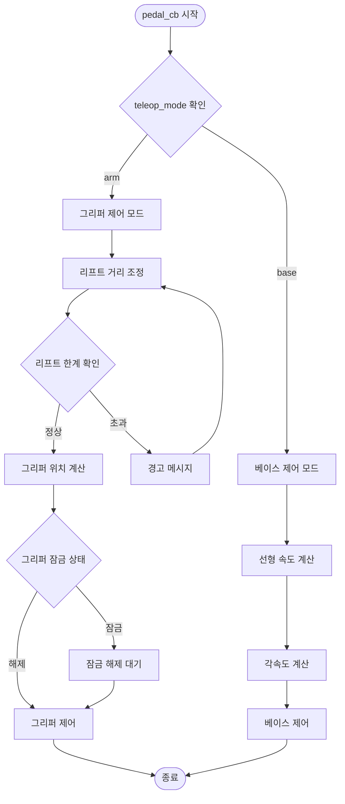
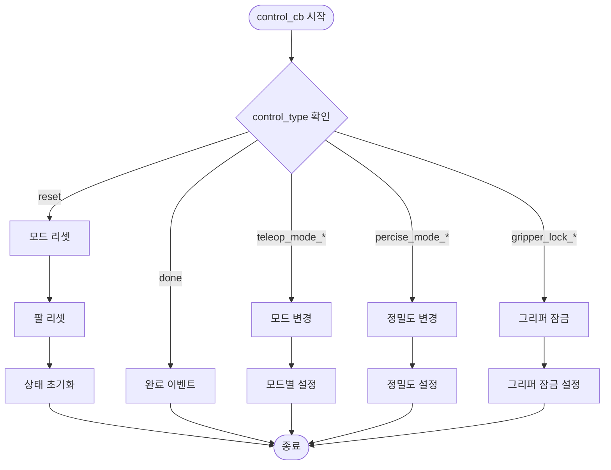
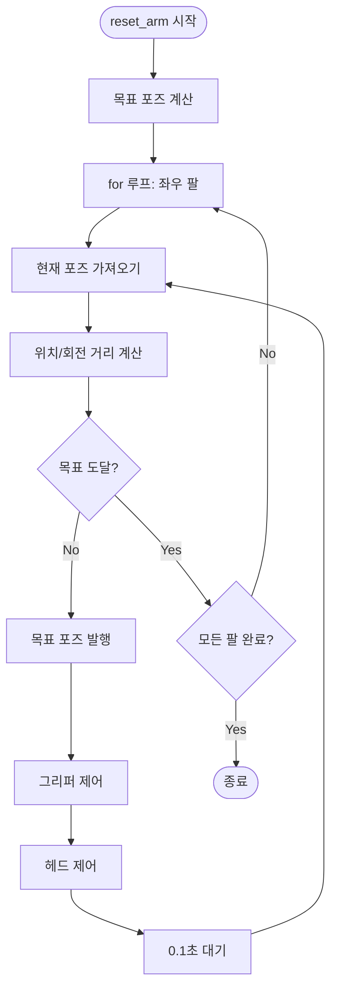
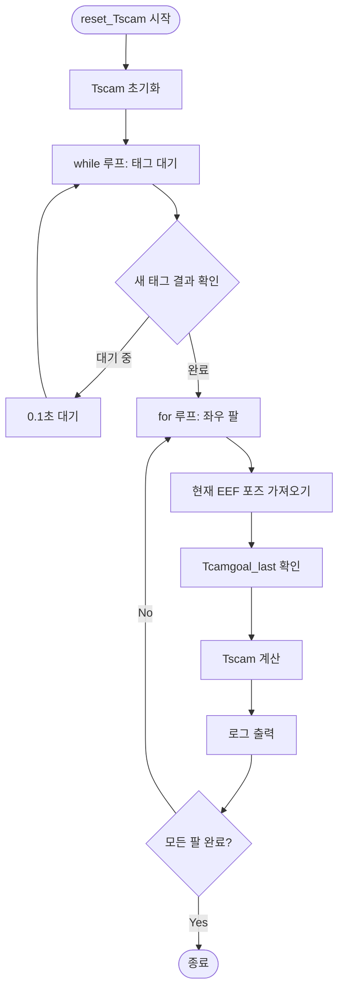
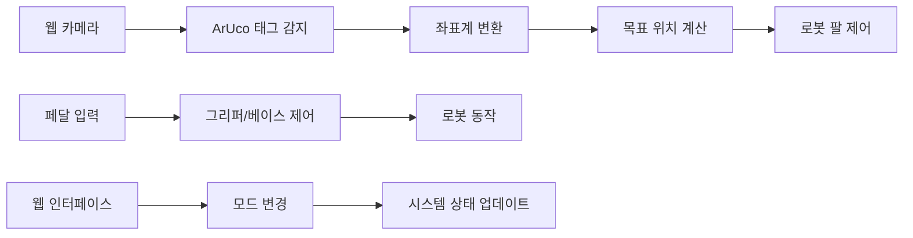

# Teleoprator.py 코드 분석

## 개요
`teleoprator.py`는 로봇 원격 조작(Teleoperation)을 위한 핵심 클래스인 `Teleopoperator`를 정의합니다. 이 클래스는 웹 기반 인터페이스를 통해 로봇의 팔과 베이스를 제어하는 시스템입니다.

## 주요 구성 요소

### 1. 클래스 구조
```python
class Teleopoperator:
    def __init__(self)
    async def reset_Tscam(self)
    async def update_percise_mode(self, percise_mode)
    def update_teleop_mode(self, teleop_mode)
    async def reset_arm(self, lift_distance, joint_bent, far_seeing)
    def get_head_tilt(self, lift_distance)
    def hand_cb(self, camera_matrix, distortion_coefficients, corners, ids)
    def pedal_cb(self, pedal_real_values)
    async def control_cb(self, control_type)
    def error_cb(self, msg)
```

### 2. 주요 상태 변수
- `teleop_mode`: 조작 모드 ("base", "arm", None)
- `percise_mode`: 정밀도 모드 (True/False/"more_percise")
- `lift_distance`: 팔의 높이 거리
- `Tscam`: 카메라-로봇 좌표계 변환 행렬
- `gripper_lock`: 그리퍼 잠금 상태
- `far_seeing`: 원거리 시야 모드

## 콜그래프 (Call Graph)



## 플로우차트 (Flowchart)

### 1. 초기화 플로우


### 2. 핸드 콜백 플로우


### 3. 페달 콜백 플로우


### 4. 컨트롤 콜백 플로우


### 5. 리셋 팔 플로우


### 6. Tscam 리셋 플로우


## 주요 기능 설명

### 1. ArUco 태그 기반 위치 추적
- 웹 카메라를 통해 ArUco 태그를 감지
- 태그의 3D 위치를 계산하여 로봇 팔의 목표 위치 결정
- 좌우 손에 대한 개별 추적

### 2. 정밀도 모드
- `percise_mode`: 일반 정밀도 (scale=1.0)
- `more_percise`: 고정밀도 (scale=0.5)
- 모션 증폭을 통해 미세한 움직임 제어

### 3. 그리퍼 제어
- 페달을 통한 그리퍼 개폐 제어
- 그리퍼 잠금 기능으로 안전성 확보
- 좌우 그리퍼 독립 제어

### 4. 베이스 제어
- 페달을 통한 로봇 베이스 이동
- 선형 속도와 각속도 제어
- 전진/후진 시 각속도 방향 자동 조정

### 5. 헤드 제어
- 리프트 거리에 따른 자동 헤드 틸트 조정
- 원거리 시야 모드 지원

## 데이터 플로우



## 에러 처리

1. **태그 미감지**: 카메라 연결 및 태그 가시성 확인 요청
2. **Tscam 미초기화**: 팔 리셋 요청
3. **리프트 한계 초과**: 경고 메시지 출력
4. **연결 실패**: 웹서버 연결 상태 모니터링

## 성능 최적화

1. **비동기 처리**: asyncio를 활용한 비동기 이벤트 처리
2. **로우패스 필터**: 센서 노이즈 제거를 위한 위치 필터링
3. **스레드 안전**: 웹서버와의 안전한 통신
4. **메모리 효율성**: 큐 기반 이미지 처리

이 시스템은 웹 기반의 직관적인 인터페이스를 통해 로봇의 정밀한 원격 조작을 가능하게 하는 고도화된 텔레오퍼레이션 시스템입니다. 