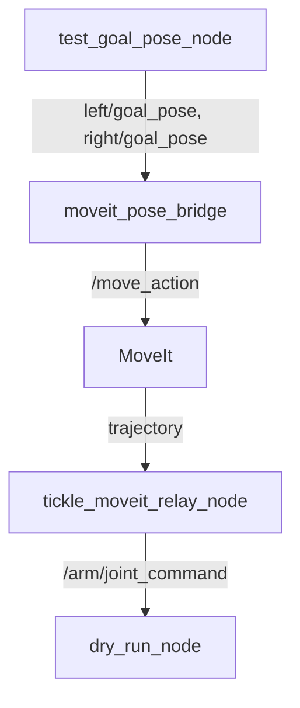

# Tickle MoveIt Launch Flow

## 시스템 개요

이 문서는 goal pose를 받아서 로봇 제어까지 이어지는 전체 파이프라인의 흐름을 설명합니다.



## 노드별 상세 설명

### 1. Goal Pose 생성 (test_goal_pose_node)
- **노드명**: `test_goal_pose_node`
- **발행 토픽**:
  - `/left/goal_pose` (geometry_msgs/PoseStamped)
  - `/right/goal_pose` (geometry_msgs/PoseStamped)
- **동작**: 5초마다 테스트용 goal pose 발행
- **위치**: `astra_controller/test_goal_pose_node.py`

### 2. MoveIt 브릿지 (moveit_pose_bridge)
- **노드명**: `moveit_pose_bridge`
- **구독 토픽**:
  - `/left/goal_pose` (geometry_msgs/PoseStamped)
  - `/right/goal_pose` (geometry_msgs/PoseStamped)
- **Action Client**:
  - `/move_action` (moveit_msgs/MoveGroup)
- **동작**: goal pose를 MoveIt action으로 변환
- **위치**: `astra_controller/moveit_pose_bridge.py`

### 3. MoveIt 시뮬레이션
- **노드명**: `move_group`
- **Action Server**: 
  - `/move_action` (moveit_msgs/MoveGroup)
- **동작**: 
  - Trajectory 계획 및 생성
  - 충돌 회피 및 경로 계획
- **Planning Groups**:
  - `left_arm_gripper_group`
  - `right_arm_gripper_group`

### 4. Trajectory Relay (tickle_moveit_relay_node)
- **노드명**: `tickle_moveit_relay_node`
- **Action Server**:
  - `left_arm_gripper_group_controller/follow_joint_trajectory`
  - `right_arm_gripper_group_controller/follow_joint_trajectory`
- **발행 토픽**:
  - `/arm/joint_command` (astra_controller_interfaces/JointCommand)
- **동작**: MoveIt trajectory를 joint command로 변환
- **위치**: `astra_controller/tickle_moveit_relay_node.py`

### 5. 하드웨어 시뮬레이션 (dry_run_node)
- **노드명**: `dry_run_node`
- **구독 토픽**:
  - `/arm/joint_command` (astra_controller_interfaces/JointCommand)
- **발행 토픽**:
  - `/joint_states` (sensor_msgs/JointState)
- **동작**: 하드웨어 시뮬레이션 및 joint state 발행
- **위치**: `astra_controller/dry_run_node.py`

## 메시지 상세 정보

### JointCommand 메시지 구조
```yaml
header:
  stamp:
    sec: 0
    nanosec: 0
  frame_id: ''
name:
  - joint_[l/r]2
  - joint_[l/r]3
  - joint_[l/r]4
  - joint_[l/r]5
  - joint_[l/r]6
  - joint_[l/r]7[l/r]
position_cmd: [6개의 joint 위치값]
```

## 주요 설정 파일
- MoveIt 컨트롤러 설정: `tickle_taesan_moveit/config/moveit_controllers.yaml`
- MoveIt 플래닝 설정: `tickle_taesan_moveit/config/ompl_planning.yaml`
- 로봇 설정: `tickle_taesan_moveit/config/astra_dual_so_arm.urdf.xacro`

## 실행 방법
1. MoveIt 및 관련 노드 실행:
   ```bash
   ros2 launch tickle_moveit.launch.py
   ```

2. 테스트 노드 실행 (새 터미널에서):
   ```bash
   ros2 run astra_controller test_goal_pose_node
   ```

## 참고 사항
- 현재는 테스트를 위해 `test_goal_pose_node`를 사용하지만, 실제 운영 시에는 `teleop_web_node`로 대체될 예정
- 하드웨어 제어 시에는 `dry_run_node` 대신 실제 하드웨어 드라이버로 교체 예정 